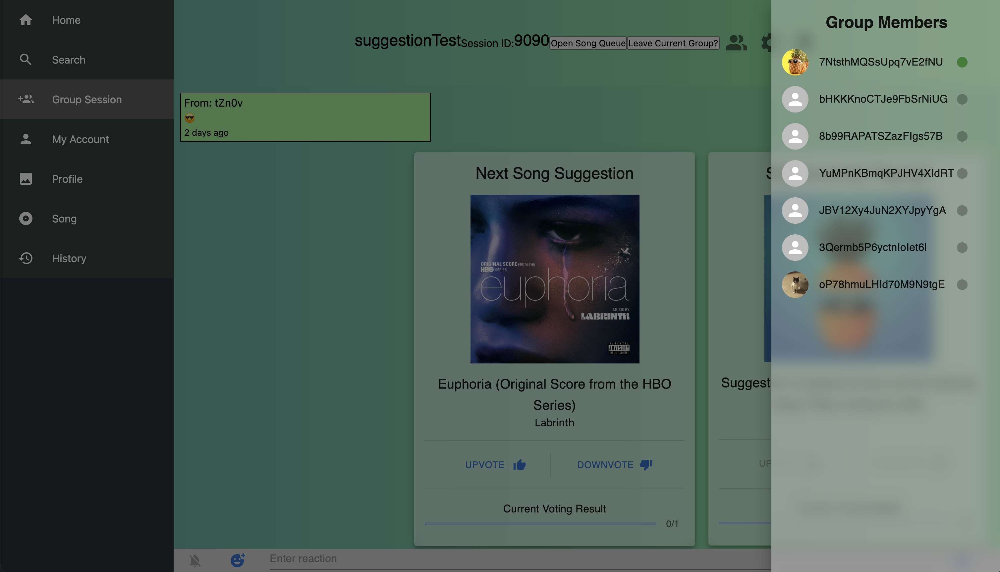

# Pineapple Music

Pineapple Music is a music listening web application integrating many new features, such as group listening, bookmarks, chat, and a music visualizer, with the Spotify API.

Pineapple Music was created in the Fall of 2021 for the CS30700 Software Engineering I class at Purdue University. The development team consisted of **Kichul Kang** (*Github: kckang1003*), **Tiger Lee** (*Github: lee3189*), **Jason Paik** (*Github: JPaik649*) **Sam Tarr** (*Github: S-Tarr*), **Thomas Wiegand** (*Github: twiegan*), and **Alan Zeng** (*Github: zeng194*).

 

# Technologies

- Frontend - React
- Backend - NodeJS
- Database - Firebase
- Authorization - Firebase

# Gallery

Group Sessions 

